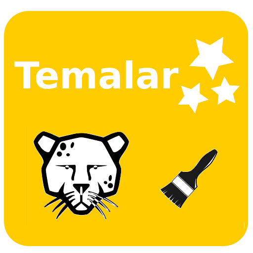
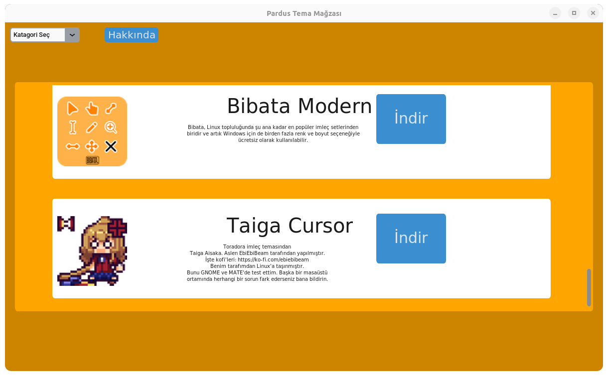
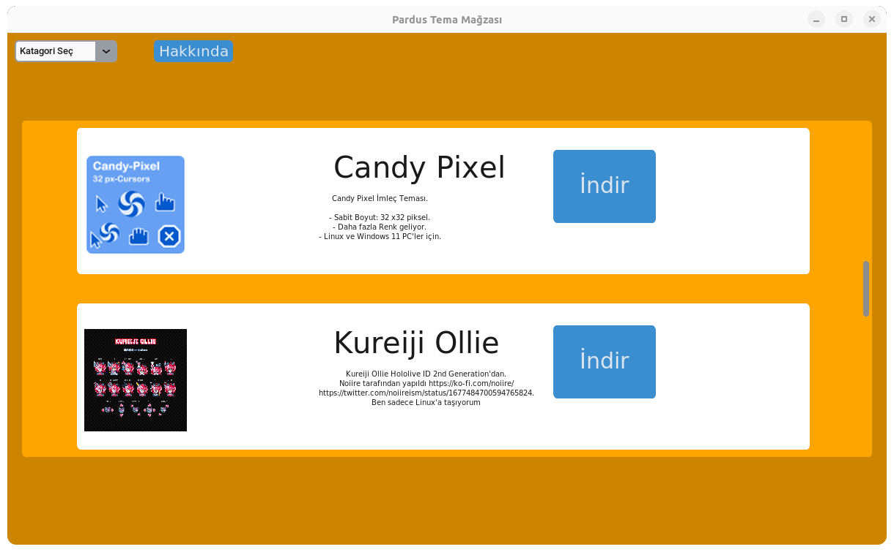
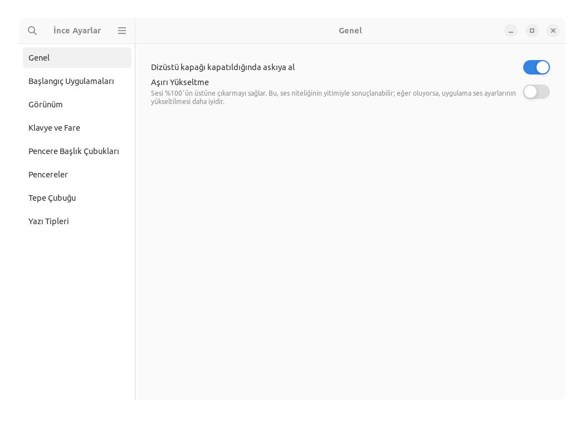
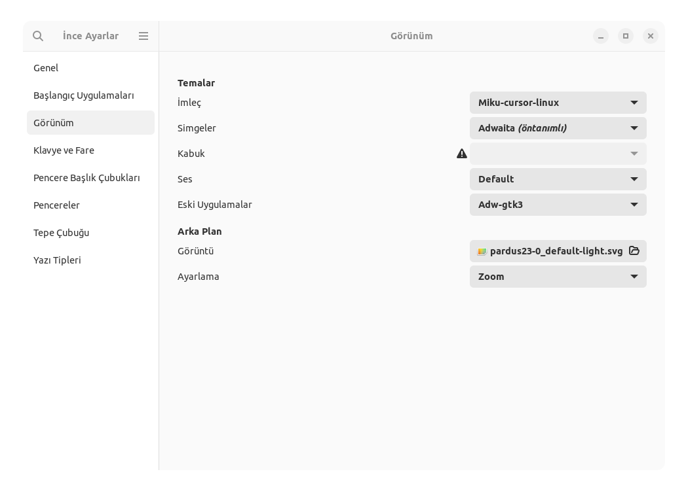
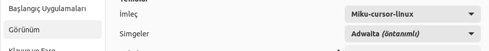

<div align="center">


  
# Pardus Tema Mağazası
Pardus Tema Mağazası, Pardus işletim sisteminizi kişiselleştirmenize ve yeni temalar indirmenize olanak tanır. Şu anda beta aşamasında olan bu mağazada 12 farklı imleç teması bulunmaktadır.
  <a>
    
  </a>
  
  
  

</div>

## Nasıl Kullanılır?
Henüz beta aşamasında olduğu için bazı optimizasyon hataları olabilir. Bir temayı "İndir" butonuna bastığınız anda, tema hızlı bir şekilde sisteminize yüklenir! Ancak bazı optimizasyon hataları nedeniyle, indirme ve kaldırma işlemleri sırasında program yanıt vermeyebilir. Bu yüzden, aynı anda birden fazla işlem yapmaya çalışmayın.

## İndirmek

### Dosyalar
Derlenmiş program dosyası: <b><a href="https://github.com/YigitC7/PardusTemaStore/releases/download/b1.0/PardusTemaMagazasi_beta1.0.zip">indir</a> 64 Bit</b>

### Manuel Derleme
Programı derlemek için aşağıdaki komudu terminale yapıştırın
```bash	
sudo apt update -y && sudo apt upgrade -y
sudo apt install git python3-venv -y
git clone https://github.com/YigitC7/PardusTemaStore.git
cd PardusTemaStore
python3 -m venv lib
source lib/bin/activate
pip install --upgrade pip setuptools wheel
pip install pyinstaller customtkinter Pillow requests
pip install --no-cache-dir --force-reinstall Pillow
pyinstaller --noconsole --onefile --windowed --hidden-import=PIL._tkinter_finder --hidden-import=PIL._imagingtk main.py
cp -f dist/main PardusTemaStore
```

## Şuanki Tema içeriği
### İmleç sayısı: 12
### Simge sayısı: 0

## İndirilen Tema Nasıl Aktif Edilir?
Bir temayı indirdiniz ama nasıl aktif hale getireceğinizi bilmiyor musunuz? o zaman şu adımları takip edin:
### 1 Pardus uygulama arama bölümüne "ince ayarlar" uygulamasını arayın ve o uygulamayı açın

## 2 Uygulamayı açtıktan sonra "Görünüm" sekmesine girin

## 3 Sekmeyi açtıktan sonra İmleçleri ve Simgeleri buradan değiştirebilirsiniz


## Uyarı!
Program henüz beta aşamasında olduğu için bazı optimizasyon hataları olabilir. Eğer internet bağlantınız zayıf veya hiç yoksa, program indirme işlemi sırasında yanıt vermeyebilir.
Bu program, Pardus XFCE sürümünde hiç test edilmemiştir. Yalnızca Gnome ortamında geliştirilip test edilmiştir. Bu nedenle, XFCE ortamında sorunsuz çalışmayabilir veya uyum sağlamayabilir.

## Dosya İşlevleri
<b>main.py</b> Programın ana penceresi bu dosyada tanımlıdır.<br>
<b>Widagets.py</b> Programda ki bütün nesneler ve butonların fonksiyonları bu dosyada bulunur.<br>
<b>data.py</b> Birçok değişken ve indirme bağlantıları burada saklanır.<br>
<b>indirme_motoru.py</b> Bu python dosyası ise tema paketlerinin indirme ve kurulum yapayı sağlayan fonksiyonlar bulunur.<br>
<b>img_create.py</b> Program üzerindeki resim ve görselleri tanımlamaya yardımcı bir fonksiyon bulunur.

## Kaynak
>Bütün tema paketleri <a href="https://www.gnome-look.org/browse/">Gnome look</a> sitesinden alınmıştır ve indirme işlemini benim Google Drive depomdan yapar, işte bütün <a href="https://drive.google.com/drive/folders/1pMVBmQWIJZRVufvMEMjYwO-ck17EqKq1?usp=drive_link">Temalar</a>
